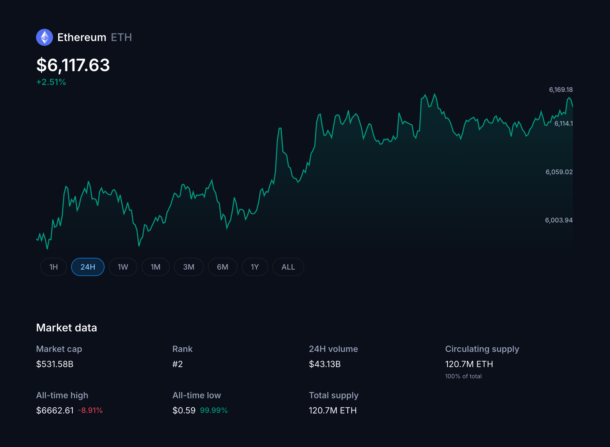

# Fullstack take-home assignment (Next.js)

Your task is to build a cryptocurrency market data dashboard that reproduces the provided screenshot using Next.js app router (mandatory). 

The application should demonstrate proficiency in server-side rendering, client-side interactivity, and production readiness. Build it as if it was the start of a bigger project you would expand on in the feature.

Feel free to use any library you see fit, as long as you can justify their use.

_For this assignment, you just need to build the page for Ethereum (ETH)._

### Core functionality

- **Server-side rendering**: Initial data should be rendered using RSC
- **Client-side updates**: Once loaded, the data should refresh automatically every 30 seconds
- **Responsive design**: The interface should work well on both desktop and mobile devices
- **Modern tech**: Use up-to-date technologies suitable for production development

### Data

You can use any cryptocurrency API. Some suggestions:
- **Crypto.com API** 
- **CoinGecko API**
- **CoinMarketCap API**

### Evaluation criteria

**Code quality**:
- Following Next.js best practices

**Functionality**:
- Proper server-side rendering
- Real-time data updates working correctly

**UI/UX**:
- Responsive design implementation
- Smooth user interactions

**Architecture**:
- Proper separation of concerns
- Scalable project structure

**Production readiness**:
- Error handling and edge cases
- Performance optimizations

### Deliverables

- **Source code**: Complete Next.js project with all source files
- **Live demo**: Deploy the application anywhere you want for us to take a look

### Bonus points

Feel free to implement any other feature or improvement you see fit. If you see something in the design that doesn't make sense or could be improved, do not hesitate to change it. The provided mockup is provided as inspiration. 

### Time limit

This should take around **3-4 hours** of development time max. We want this to be reflected in the commits.
